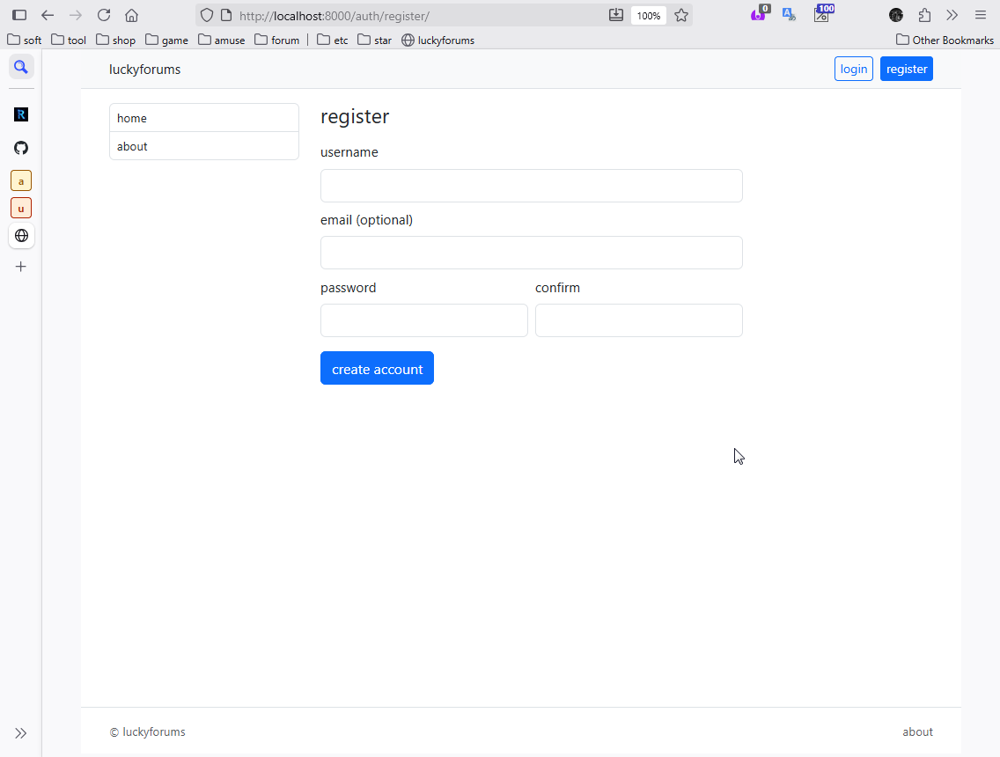
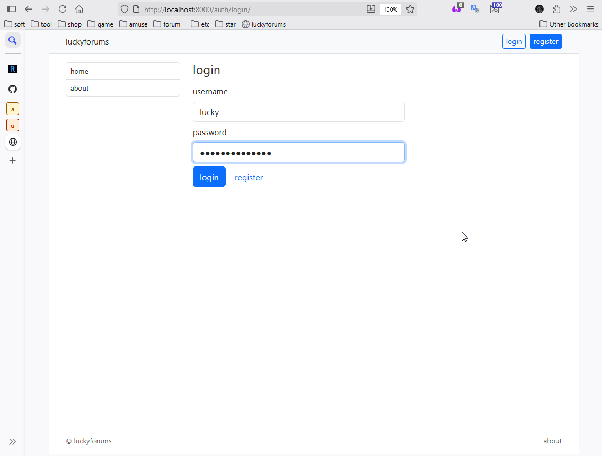
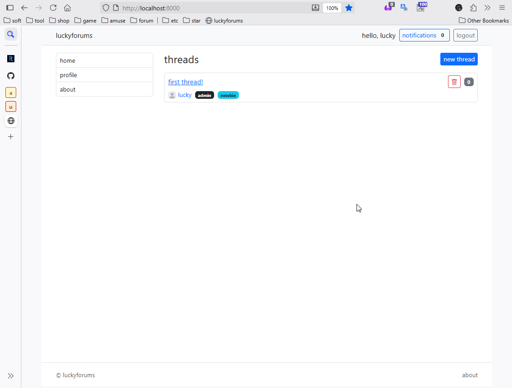
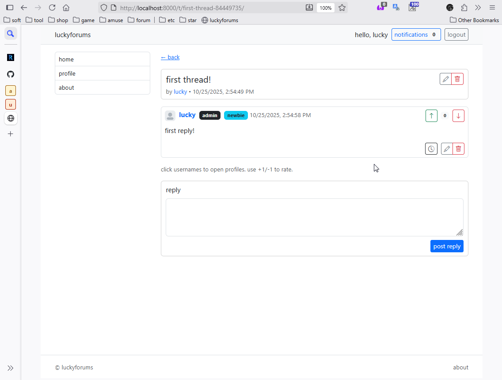
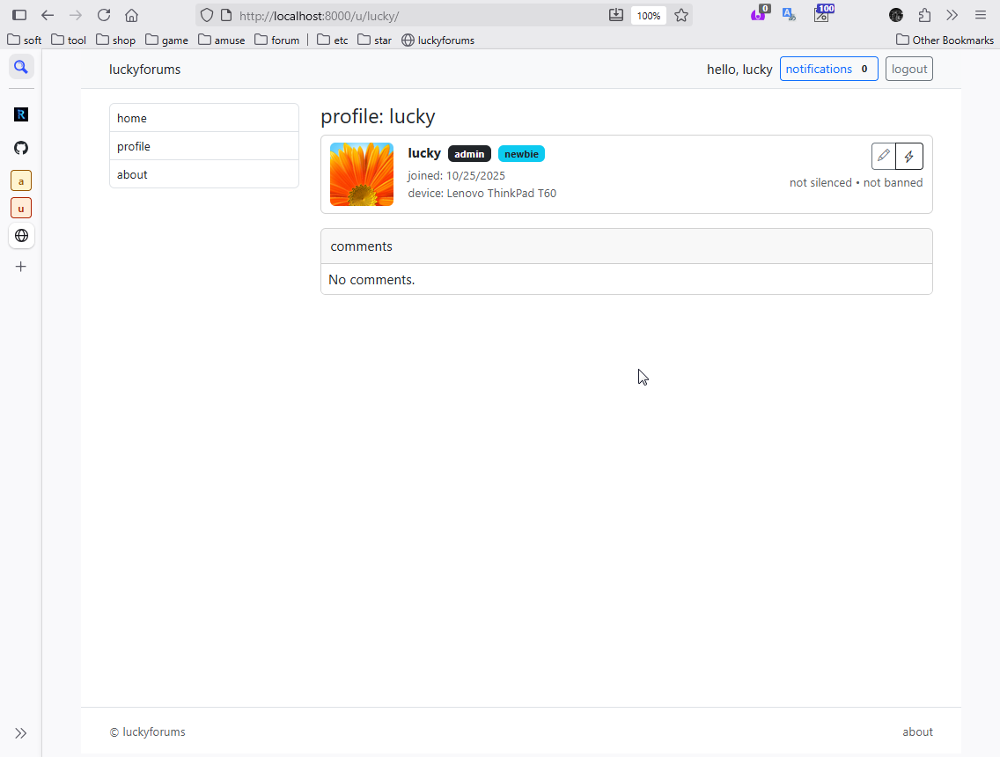
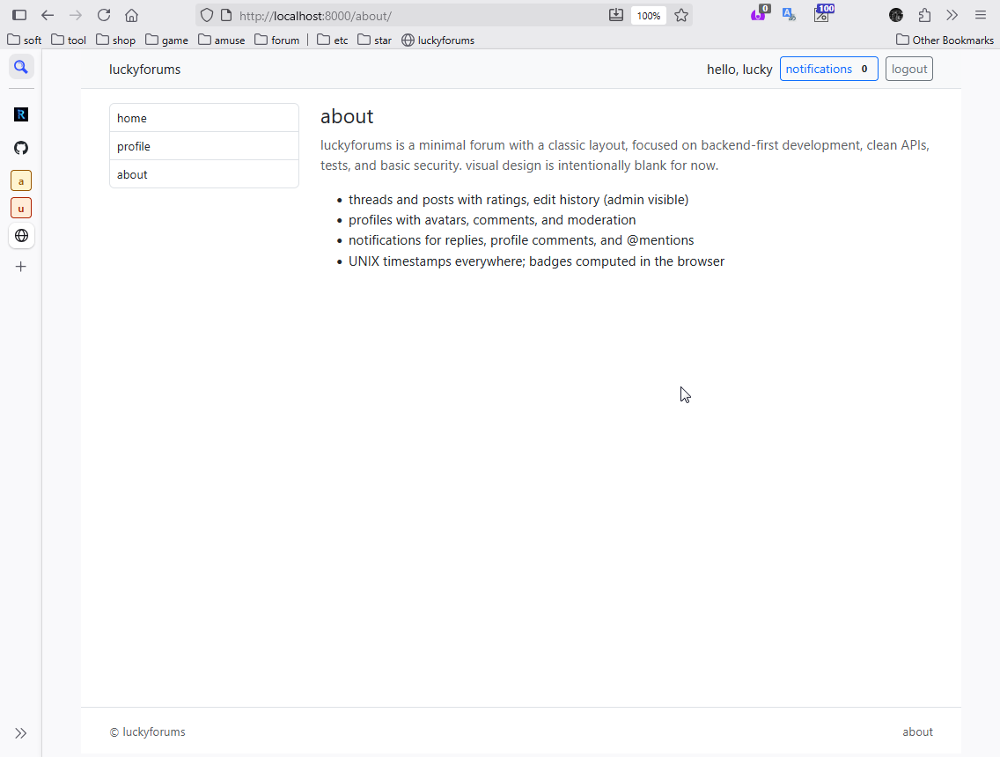

# LUCKYFORUMS

a minimal, backend-first discussion forum built with `django` and `django rest framework`. it targets a classic ~2010 web layout, keeps the visual theme intentionally blank, and focuses on clean APIs, tests, and basic security.

## OVERVIEW

`luckyforums` provides...

### ACCOUNTS

- register;
- login; (session UI)
- logout; (session UI)
- `JWT` API auth for programmatic access.

### FORUM

- threads and posts with ratings;
- edit history; (admin visible)
- deletions that cascade history.

### PROFILES

- editable profiles;
- profile comments;
- comment ratings;
- comment edit history.

### ROLES

- `user` and `admin`;
- admins can override permissions;
- admins can silence or ban users.

### NOTIFICATIONS

- thread replies;
- profile comments;
- and `@mentions`.

### TIMESTAMPS

- all API timestamps are `UNIX` seconds;
- browser computes badges and formatted dates.

### TESTS

- `pytest` test suite;
- `black` + `isort` for formatting.

## SHOWCASE

### REGISTRATION PAGE



### AUTHORIZATION PAGE



### HOME PAGE



### THREAD PAGE



### PROFILE PAGE



### ABOUT PAGE



## STACK

### LANGUAGE

- `python`, version `3.11.14`.

### FRAMEWORKS

- `django`, version `4.2.x`;
- `django rest framework`.

### AUTH

- `django` session auth for UI;
- `simplejwt` for API tokens.

### DB

- `postgresql`. (`docker-compose` service)

### FRONT

- ND... `django` templates;
- `bootstrap`, version `5`;
- `jquery`. (`AJAX`)

### TOOLING

- `poetry`;
- `black`;
- `isort`;
- `pytest`;
- `pytest-django`.

## LIBRARIES

- `django`;
- `djangorestframework`;
- `djangorestframework-simplejwt`;
- `drf-nested-routers`;
- `django-filter`;
- `pillow` (avatars);
- `python-decouple`; (env)
- `shortuuid`;
- `bleach`/`markdown`; (optional content safety)
- `black`;
- `isort`;
- `flake8`;
- `pytest`;
- `pytest-django`;
- `pytest-cov`;
- `model-bakery`.

## PROJECT STRUCTURE

```plain
.
├── lucky_forums/            # PROJECT SETTINGS, URLS
├── forum/                   # THREADS, POSTS, RATINGS, PAGES AND API
│   ├── models.py            # THREAD, POST, POSTEDIT, POSTRATING
│   ├── serializers.py       # THREADSERIALIZER, POSTSERIALIZER (+UNIX TIMESTAMPS)
│   ├── views.py             # VIEWSETS: THREAD, POST; RATING/HISTORY ACTIONS
│   ├── api_urls.py          # /API/THREADS/, NESTED POSTS
│   ├── pages.py             # HOME (LIST), THREAD DETAIL/EDIT PAGES
│   ├── templates/           # BASE LAYOUT, FORUM PAGES
│   └── static/forum/app.js  # AJAX LOGIC (THREADS/POSTS, BADGES, NOTIFICATIONS)
├── users/                   # AUTH, PROFILES, COMMENTS/RATINGS, MODERATION, NOTIFICATIONS
│   ├── models.py            # PROFILE(+SILENCED/BANNED), PROFILECOMMENT, PROFILECOMMENTEDIT, NOTIFICATION
│   ├── serializers.py       # USER/PROFILE/PROFILECOMMENT (+UNIX TIMESTAMPS)
│   ├── api_urls.py          # /API/AUTH/; PROFILE APIS UNDER /API/USERS/
│   ├── profile_views.py     # PROFILE API VIEWS
│   ├── notifications.py     # NOTIFY THREAD REPLIES / PROFILE COMMENTS / MENTIONS
│   ├── notifications_api.py # LIST AND MARK READ
│   ├── moderation_api.py    # ADMIN SILENCE/BAN
│   ├── notifications_api_urls.py
│   ├── moderation_api_urls.py
│   ├── pages.py             # SESSION REGISTER PAGE + PROFILE SHELLS
│   └── templates/           # REGISTRATION/LOGIN, USERS/PROFILE PAGES
├── scripts/                 # FORMAT.SH, RESET.SH
├── docker-compose.yml       # POSTGRESQL (16-ALPINE)
├── dockerfile               # MULTI-STAGE POETRY BUILD
├── pyproject.toml           # POETRY + DEV TOOLING CONFIG
└── readme.md

```

## FEATURES

### REGISTRATION & LOGIN

session-based UI (CSRF-protected) and `JWT` endpoints for API clients;

profiles auto-created upon registration. (backfilled for existing users)

### FORUM

threads; (create, list, retrieve, edit, delete)

posts within threads (create, list, edit, delete) with ratings;

edit history stored and returned only to admins; deleted content removes its history.

### PROFILES

editable (avatar, bio, device) with placeholder avatar if none;

profile comments (create, list, edit, delete) with ratings and admin-visible edits history.

### ROLES AND MODERATION

users own their content; admins can override permissions;

profile owners can moderate comments on their own profile;

admins can silence or ban users via API.

### NOTIFICATIONS

thread reply, profile comment, and `@mention` events;

simple list & mark-read API.

### TIMESTAMPS & BADGES

all API timestamps are `UNIX` seconds;

browser computes: `newbie` (`< 7 days`), and dynamic `N years` badges;

role/state badges (`user`/`admin`/`silenced`/`banned`).

## GETTING STARTED

### PREREQUISITES

- `python`, version `3.11.14`;
- `poetry`;
- `docker` + `docker compose`.

### STEP ONE

install dependencies...

```bash
poetry env use 3.11.14
poetry install --no-root

```

### STEP TWO

start `postgresql`...

```bash
docker compose up -d postgres

```

### STEP THREE

environment file `.env`...

```bash
DEBUG=1
ALLOWED_HOSTS=localhost
SECRET_KEY=jsFBn0Afhv09KaBhlteigiw6SMrgDTCIjeLStuEuuIo9cswAG27v5yiq5YRvgvBs86g
POSTGRES_DB=luckyforum
POSTGRES_USER=luckyforum_user
POSTGRES_PASSWORD=TODO_CHANGE_ME_luckyforum_pass
POSTGRES_HOST=localhost
POSTGRES_PORT=5432

```

### STEP FOUR

migrate and create admin...

```bash
poetry run python manage.py migrate
poetry run python manage.py createsuperuser

```

### STEP FIVE

run dev server...

```bash
poetry run python manage.py runserver 0.0.0.0:8000

```

## API SURFACE

### AUTH

```plain
POST /api/auth/register/ {username, email?, password, password2}
POST /api/auth/token/ {username, password}
POST /api/auth/token/refresh/ {refresh}
GET  /api/auth/me/
```

### FORUM

```plain
GET          /api/threads/
POST         /api/threads/ {title}
GET          /api/threads/{slug}/
PATCH/DELETE /api/threads/{slug}/ (owner/admin)
GET          /api/threads/{slug}/posts/
POST         /api/threads/{slug}/posts/ {body}
PATCH/DELETE /api/threads/{slug}/posts/{id}/ (owner/admin)
POST/DELETE  /api/threads/{slug}/posts/{id}/rate/ {value: 1|-1}
GET          /api/threads/{slug}/posts/{id}/history/ (admin)
```

### PROFILES & COMMENTS

```plain
GET          /api/users/{username}/profile/
GET/PATCH    /api/users/me/profile/
GET/POST     /api/users/{username}/comments/
PATCH/DELETE /api/users/{username}/comments/{id}/ (author/admin or profile owner)
POST/DELETE  /api/users/{username}/comments/{id}/rate/
GET          /api/users/{username}/comments/{id}/history/ (admin)
```

### MODERATION & NOTIFICATIONS

```plain
PATCH /api/users/{username}/moderation/ {silenced_until?, banned_until?} (UNIX; admin)
GET   /api/notifications/?unread=1
POST  /api/notifications/{id}/read/
```

### NOTES

all datetime fields are `UNIX` seconds; clients format them as needed;

badges are computed on the client from user metadata. (role, join date, moderation state)

## FRONT-END

classic ~2010 layout;

`bootstrap`, version `5` + `jquery`;

`AJAX` driven for thread and profile flows;

blank theme; minimal styling; avatars shown everywhere with placeholders.

## MODERATION

silence/ban stored on profile with `UNIX` timestamps;

silenced/banned users cannot create/edit posts, threads, or profile comments;

admins can delete or edit content and view histories.

## TESTS & STANDARDS

`pytest` suite (api, pages, permissions, notifications, moderation, formatting)

```bash
poetry run pytest -q

```

## FORMATTING & IMPORTS

```bash
bash scripts/format.sh

```

## STANDARDS

API timestamps are `UNIX` seconds;

browsers compute small date/math; (badges, relative times)

basic security: `CSRF` for session, `JWT` for API, role/ownership checks, admin overrides.

## SCRIPTS

- `scripts/reset.sh`

resets db in the running `postgres` container, deletes migrations, re-creates/migrates.

- `scripts/format.sh`

runs `isort` and `black`. (`format` or `check` mode)

## DOCKER

- `compose.yml` provides a `postgres`, version `16` service on `${POSTGRES_PORT:-5432}`;
- `Dockerfile` builds a slim `python`, version `3.11` image with `poetry` installed deps.

## ROADMAP (FUTURE IDEAS)

- [ ] background workers for digest notifications;
- [ ] richer moderation audit trails;
- [ ] optional markdown preview and safe rendering;
- [ ] pagination and search.
